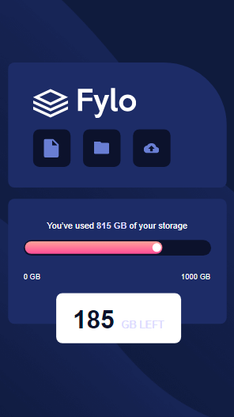
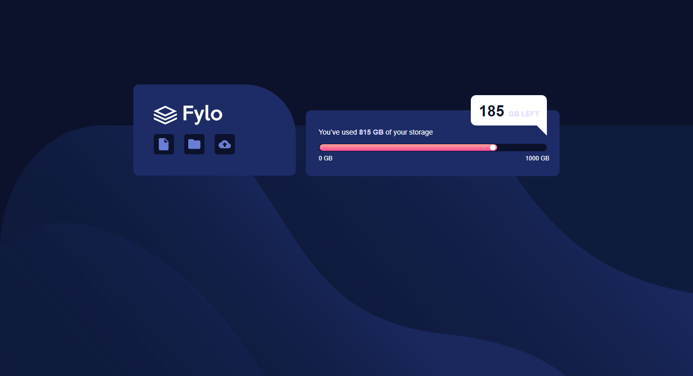

# Frontend Mentor - Fylo data storage component solution

This is a solution to the [Fylo data storage component challenge on Frontend Mentor](https://www.frontendmentor.io/challenges/fylo-data-storage-component-1dZPRbV5n). Frontend Mentor challenges help you improve your coding skills by building realistic projects. 

## Table of contents

- [Overview](#overview)
  - [The challenge](#the-challenge)
  - [Screenshot](#screenshot)
  - [Links](#links)
- [My process](#my-process)
  - [Built with](#built-with)
  - [Useful resources](#useful-resources)
- [Author](#author)


**Note: Delete this note and update the table of contents based on what sections you keep.**

## Overview

### The challenge

Users should be able to:

- View the optimal layout for the site depending on their device's screen size

### Screenshot






### Links

- Solution URL: [Add solution URL here](https://your-solution-url.com)
- Live Site URL: [Add live site URL here](https://your-live-site-url.com)

## My process

### Built with

- Semantic HTML5 markup
- CSS custom properties
- Flexbox
- Mobile-first workflow
- [Styled Components](https://styled-components.com/) - For styles


```html
<h1>Some HTML code I'm proud of</h1>
```
```css
.proud-of-this-css {
    --Gradient: hsl(6, 100%, 80%) to hsl(335, 100%, 65%);
    --PaleBlue: hsl(243, 100%, 93%);
    --GrayishBlue: hsl(229, 7%, 55%);
    --DarkBlue: hsl(228, 56%, 26%);
    --VeryDarkBlue: hsl(229, 57%, 11%);
}


## Author
- Website - [Jeronimo Nsue Mba](https://www.your-site.com)
- Frontend Mentor - [@yourusername](https://www.frontendmentor.io/profile/yourusername)
- Twitter - [@rich_nsue](https://www.twitter.com/)
